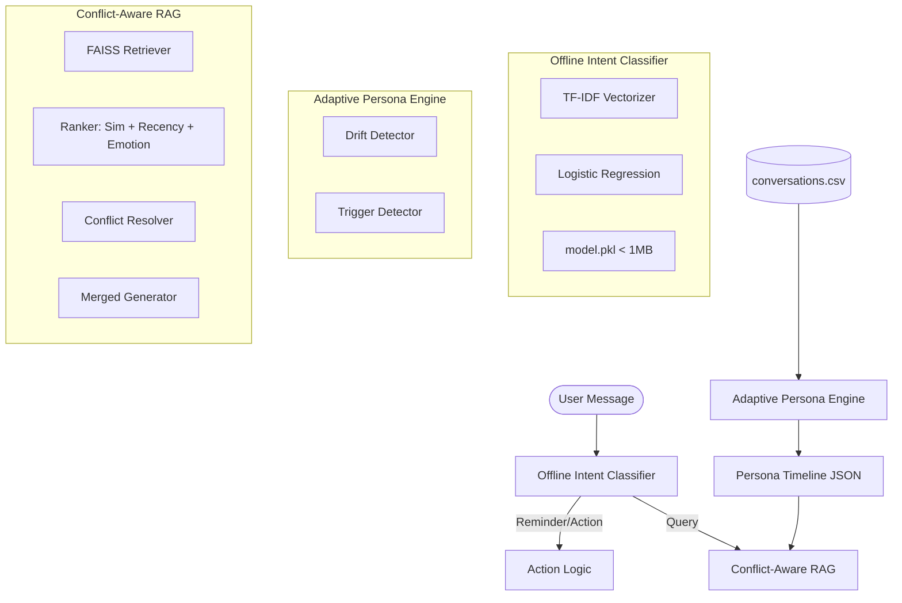

# Round 2 System Design: Adaptive Memory & Offline Intelligence

## 1. Overview
This extension transforms the Round 1 RAG system into a proactive, personality-aware assistant. It adds temporal persona tracking, ultra-fast offline intent classification, and a conflict-resolution layer for inconsistent memories.

## 2. Architecture Diagram (Textual Representation)

## 3. Module Breakdown

### Part 1: Adaptive Persona Drift Engine
*   **PersonaTimeline**: Groups conversations by day and extracts traits.
*   **DriftDetector**: Calculates a Jaccard-based distance between daily persona states to detect "drift".
*   **TriggerDetector**: Uses keyword extraction and pattern matching to identify topics (e.g., "debugging") causing tone shifts.

### Part 2: Offline Intent Classifier
*   **Technology**: TF-IDF + Logistic Regression.
*   **Performance**: < 10ms CPU inference, < 1MB model size.
*   **Categories**: `reminder`, `emotional-support`, `action-item`, `small-talk`, `unknown`.
*   **Engineering Choice**: Avoided DistilBERT to guarantee 200ms latency and minimal dependency footprint.

### Part 3: Conflict-Aware RAG Resolver
*   **Ranking**: Weighted score (50% Semantic Similarity, 30% Recency, 20% Emotional Weight).
*   **Conflict Resolution**: Rule-based detection of contradictory facts (e.g., location changes).
*   **Merging**: Explicitly notifies the user of inconsistencies (e.g., "You previously said X, but later mentioned Y").

## 4. Local Storage & Sync Strategy
*   **Local Storage**:
    *   `conversations.csv`: Raw message logs.
    *   `persona_timeline.json`: Processed daily states.
    *   `faiss_index.bin`: Vector embeddings.
    *   `model.pkl`: Classifier weights.
*   **Sync Strategy**: 
    *   Persona traits and high-level summaries sync to the cloud for cross-device consistency.
    *   Raw `conversations.csv` stays local for privacy.
*   **Conflict Resolution**: 
    *   Cloud-to-Local sync uses a "Latest Write Wins" (LWW) strategy for facts, but preserves chronological history in the timeline.

## 5. Privacy & Security
*   **Zero-Call Classifier**: All intent classification happens on-device; no text leaves the system for categorization.
*   **PII Masking**: Topic summaries are generated with heuristic PII removal (regex-based).
*   **Local-First**: All vector retrieval and persona extraction run on local CPU.
